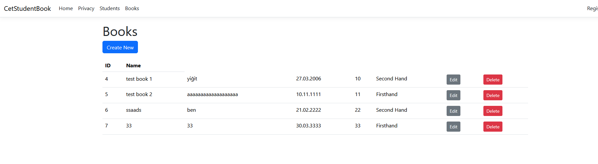
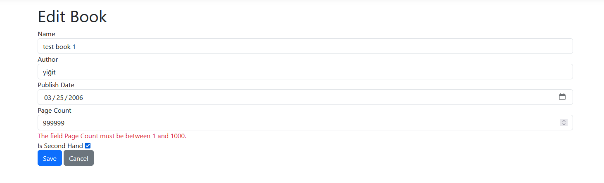

# Assignment: Books CRUD

## Implemented APIs:
- ### /Book/Create/
- - Creates a book with the given parameters

- ### /Book/Update/{id}
- - Updates a book with the given ID

- ### /Book/Delete/{id}
- - Deletes a book with the given ID


## Running the project locally
0. Install [git](https://git-scm.com/install/) and [postgresql](https://www.postgresql.org/download/)
1. Create a postgresql instance with superuser password "1" (or update appsettings.json with the correct username/password)
2. Clone the git repository via ``` git clone https://github.com/NexDen/CetStudentBook/```
3. Navigate to the project directory via ``cd ./CetStudentBook/CetStudentBook/``
4. Run migrations via ``dotnet ef database update``
5. Build project via ``dotnet build .``
6. Run project via ``dotnet run .``


## Screenshots
### Books Page


### Edit Page (with validation error)


### Delete Confirmation


## AI Usage Disclaimers
- ChatGPT Use in ``Views/Book/Index.cshtml`` lines 50-56